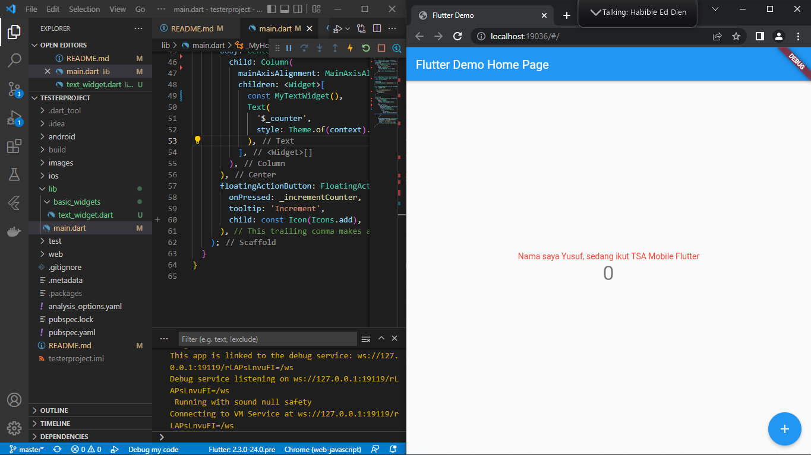
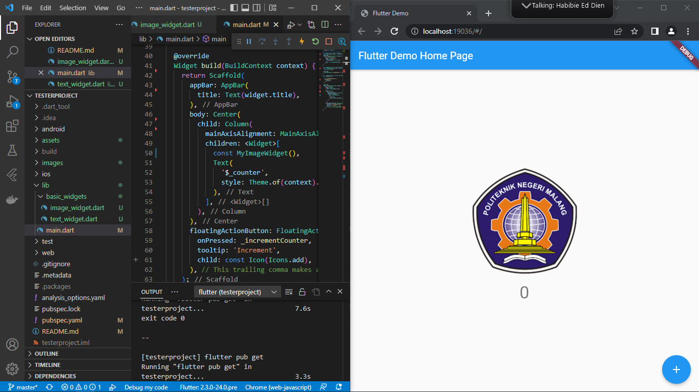
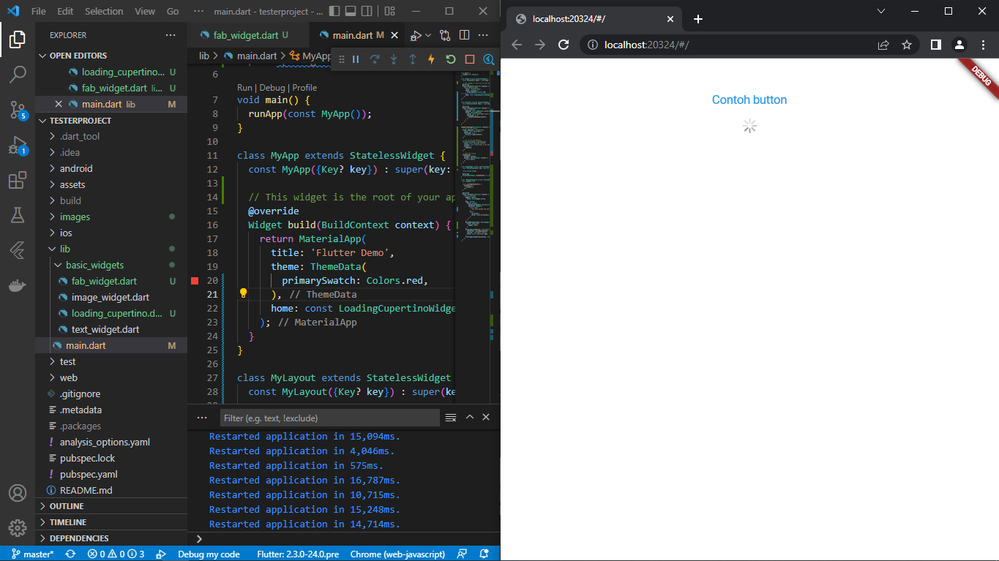
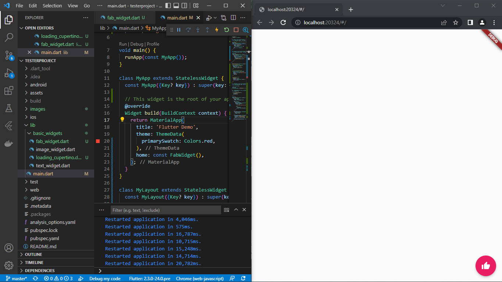
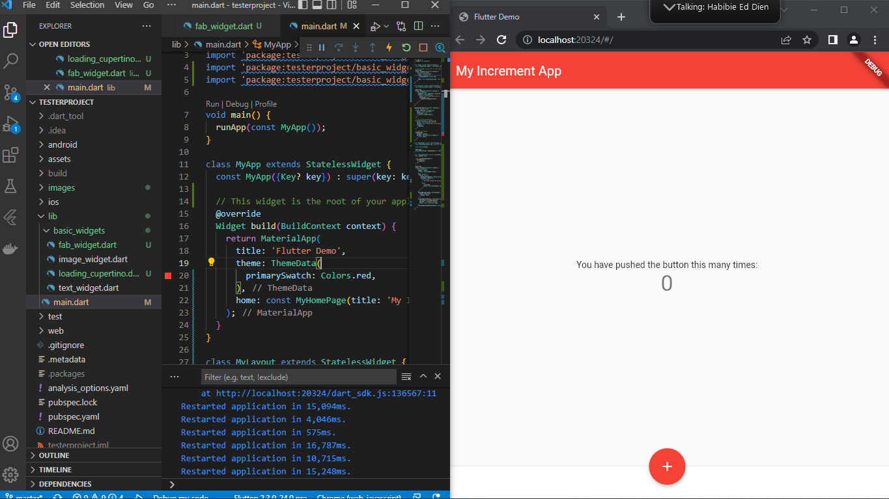
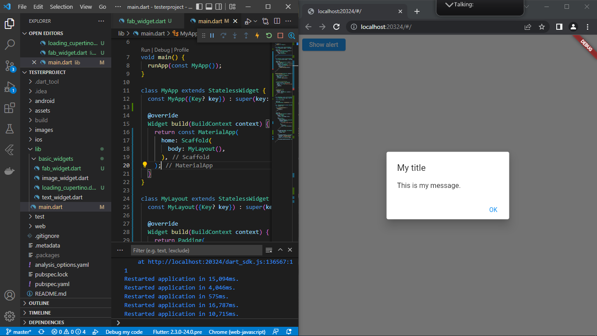
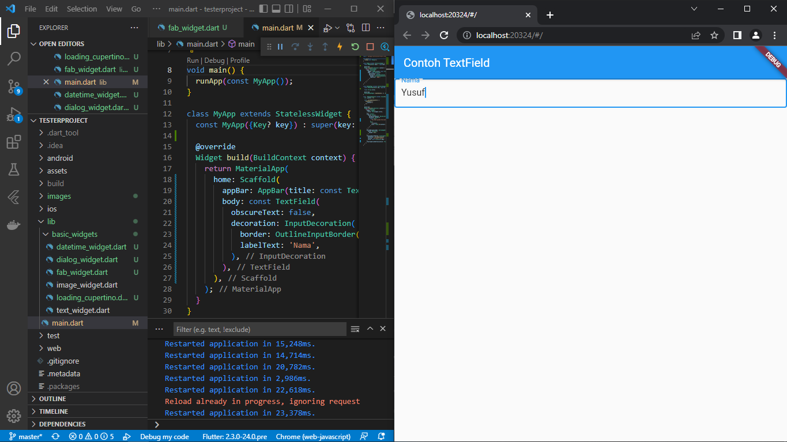
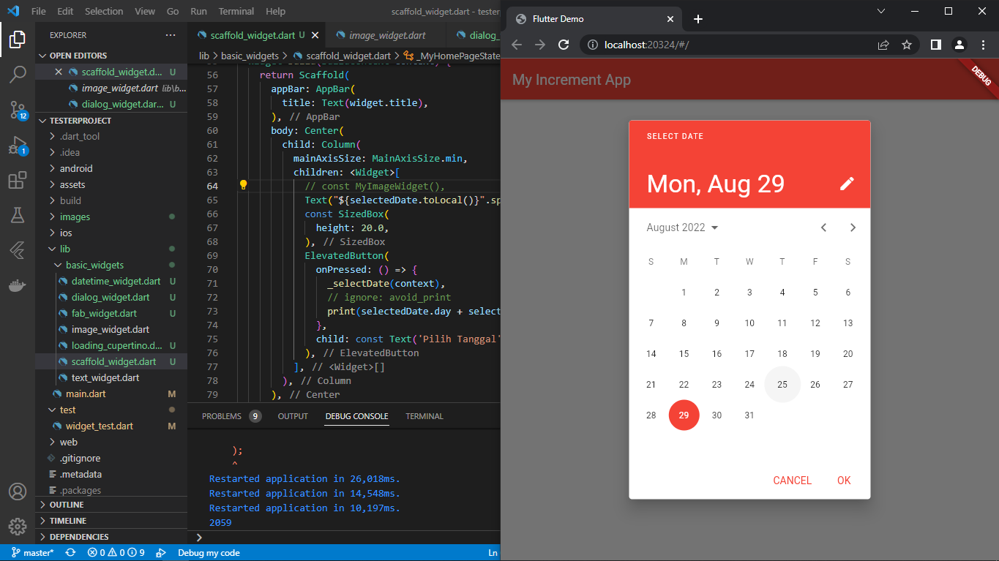

# TSA Mobile

A new Flutter project.

## Praktikum 2 Membuat Repository GitHub dan Laporan Praktikum

## Praktikum 3 Menerapkan Widget Dasar

### Langkah 2: Image Widget

## Praktikum 4: Menerapkan Widget Material Design dan iOS Cupertino
### Langkah 1: Cupertino Button dan Loading Bar

### Langkah 2: Floating Action Button (FAB)

### Langkah 3: Scaffold Widget

### Langkah 4: Dialog Widget

### Langkah 5: Input dan Selection Widget

### Langkah 6: Date and Time Pickers

