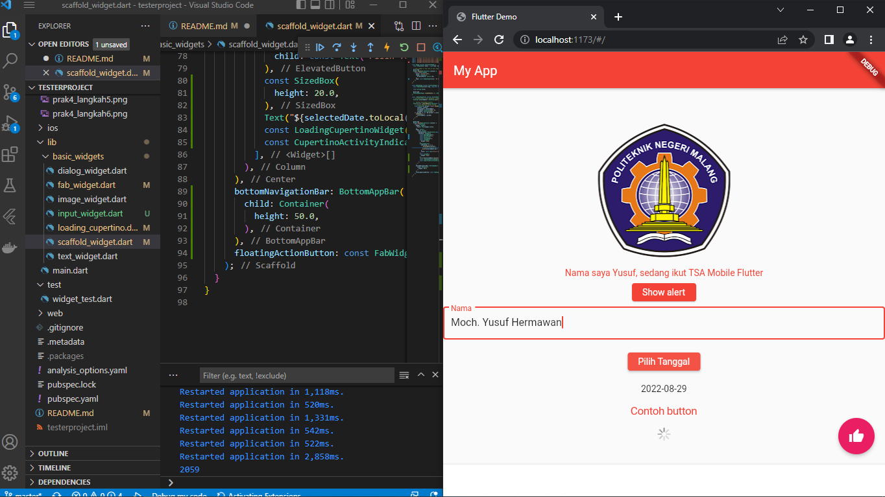

# TSA Mobile

A new Flutter project.

## Praktikum 2 Membuat Repository GitHub dan Laporan Praktikum

Menampilkan hasil project flutter setelah pembuatan project, yang berisi class MyApp dengan widget build return MaterialApp dengan memanggil home class HomePage extends StatefulWidget
## Praktikum 3 Menerapkan Widget Dasar

Menampilkan hasil project flutter, yang memanggil class MyTextWidget dengan widget build return Text diatas widget increament counter
### Langkah 2: Image Widget

Menampilkan hasil project flutter, yang memanggil class MyImageWidget dengan widget build return image berisi pemanggilan asset image logo polienma diatas widget increament counter
## Praktikum 4: Menerapkan Widget Material Design dan iOS Cupertino
### Langkah 1: Cupertino Button dan Loading Bar

Menampilkan hasil project flutter, yang memanggil class LoadingCupertinoWidget dengan widget build return CupertinoButton yang memanggil class indikator cupertino yang bernama CupertinoActivityIndicator pada MaterialApp home
### Langkah 2: Floating Action Button (FAB)

Menampilkan hasil project flutter, yang memanggil class FabWidget dengan widget build return FloatingButton pada MaterialApp home
### Langkah 3: Scaffold Widget

Menampilkan hasil project flutter, yang memanggil class yang berisi class MyApp dengan widget build return MaterialApp dengan memanggil home class HomePage extends StatefulWidget
### Langkah 4: Dialog Widget

Menampilkan hasil project flutter, yang memanggil class yang berisi class MyApp dengan widget build return MaterialApp dengan memanggil home class HomePage extends StatefulWidget
### Langkah 5: Input dan Selection Widget

Menampilkan hasil project flutter, yang memanggil class InputWidget dengan widget build return TextField 
### Langkah 6: Date and Time Pickers

Menampilkan hasil project flutter, yang dimana terdapat inisialisasi DateTime beserta pemanggilan variabel SelectedDate berisi tanggal sekarang kemudian pada widget menampilkan elevated button yang ketika diklik akan muncul filter tanggal sekarang
## Tugas Praktikum

Menampilkan hasil project flutter, yang dimana file main.dart terdapat pemanggilan widget-widget yang ada pada folder basic widget 

